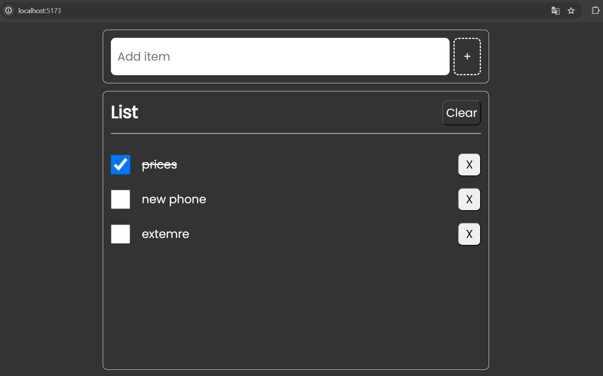

# Lesson 11 Project - TODO LIST

This project was created using Vite with vanilla JavaScript and TypeScript.

## Installation Process

### Step 1: Create a New Project
step 1: npm create@vitelastest
Run the following command to create a new project:
to make a new folder - Project name: lesson 11
select framework - vanilla
typeScript

to run this project --- npm run dev

<!--  -->
